# Cred Domain Support Agent: System Architecture & Technical Design Specification

> **Full Documentation:** See detailed document at [doc/architecture.md](file:///c:/Users/kastu/Desktop/captstone%20-%20bank/doc/architecture.md).

**Track:** Banking & FinTech (Cred)  
**System:** Multi-Agent Lending Operations Support Platform  
**Target Frameworks:** CrewAI, AutoGen, ChromaDB, SentenceTransformers, FastAPI, Pydantic, LangChain  
**Execution Profile:** 100% Offline, Deterministic, Zero Telemetry, Zero Cloud Dependencies  

---

## 1. Executive Summary & Architectural Principles

The **Cred Domain Support Agent** is an enterprise-grade AI operations platform built for lending operations support at Cred. The system resolves complex customer inquiries regarding retail lending policies, credit terms, KYC procedures, and real-time loan application lifecycle statuses.

Lending operations represent a high-stakes financial domain subject to strict regulatory compliance, data privacy mandates, and zero tolerance for hallucination or data leakage. To satisfy these operational requirements in an isolated testing environment, the architecture operates under four core pillars:

```text
┌─────────────────────────────────────────────────────────────────────────────┐
│                           CORE ARCHITECTURAL PILLARS                         │
├───────────────────────┬─────────────────────────┬───────────────────────────┤
│ 1. Zero External Net  │ 2. Deterministic        │ 3. Dual-Layer Multi-Agent │
│    & Zero Telemetry   │    Reproducibility      │    Verification           │
│  - No external APIs   │  - Fixed random seeds   │  - CrewAI primary crew    │
│  - Local embeddings   │  - Offline Mock LLM     │  - AutoGen peer review    │
│  - ChromaDB on disk   │  - Mathematical bounds  │  - Pydantic contracts     │
└───────────────────────┴─────────────────────────┴───────────────────────────┘
```

1. **Air-Gapped & Cost-Free Execution:** Embeddings are generated locally via `SentenceTransformers` (`all-MiniLM-L6-v2`), stored in disk-persisted `ChromaDB` instances, and reasoned over by an offline deterministic `MOCK_LLM` derived from `crewai.llms.base_llm.BaseLLM`. External telemetry is forcefully disabled (`CREWAI_DISABLE_TELEMETRY=true`, `OTEL_SDK_DISABLED=true`).
2. **Deterministic Reproducibility:** Data generation, RAG chunking, vector indexing, escalation scoring, and LLM-as-a-judge evaluations run deterministically using fixed seeds, explicit thresholds, and mathematical invariants.
3. **Defense-in-Depth AI Governance:** A 4-layer governance model enforces least autonomy for tools, strict regex PII masking (PAN, Aadhaar, Account Numbers), input injection rejection, runtime token budget guards, and post-generation policy compliance reviews via AutoGen.
4. **Production Observability & High Performance:** Fast return paths are guaranteed through an in-memory normalized query cache, while FastAPI exposes HTTP REST and WebSocket duplex channels backed by structured, ELK-compatible JSON-L audit logging with unique trace IDs.

---

## 2. End-to-End System Architecture

The following diagram illustrates the complete end-to-end data processing lifecycle from inbound user query to audited response delivery:

```mermaid
flowchart TD
    %% Inbound Traffic
    UserQuery["Inbound User Query (HTTP POST / WebSocket)"] --> BudgetGuard["Runtime Budget Guard\n(Character & Token Ceiling Check)"]
    
    BudgetGuard -- "Size Exceeded (> 413)" --> Err413["HTTP 413: Request Entity Too Large"]
    BudgetGuard -- "Within Budget" --> InputGuard["Input Guardrail Filter\n- PAN/Aadhaar/Acc Regex Masking\n- Prompt Injection Pattern Detector"]
    
    InputGuard -- "Injection Detected" --> InjectionRefusal["Security Rejection (400 Bad Request)"]
    InputGuard -- "Sanitized Query" --> CacheCheck{"Normalized Cache Lookup\n(query.strip().lower())"}
    
    %% Fast Path
    CacheCheck -- "Cache Hit" --> CacheHitLog["Attach Cache Hit Flag & Latency"]
    CacheHitLog --> StructuredLogger
    
    %% Core Agent Processing Path
    CacheCheck -- "Cache Miss" --> SessionMemory["LangChain Session Memory\n(InMemoryChatMessageHistory)"]
    SessionMemory --> CrewCoordinator["CrewAI Primary Orchestrator\n(Deterministic MockLLM Subclass)"]
    
    subgraph CrewAI_Subsystem ["CrewAI Multi-Agent Pipeline"]
        CrewCoordinator --> IntentRouter{"Intent Classification"}
        
        IntentRouter -- "Policy Inquiry" --> RetrievalAgent["Retrieval Agent\n(ChromaDB RAG Tool Only)"]
        RetrievalAgent --> ChromaStore[("ChromaDB Vector Store\nSentenceTransformers all-MiniLM-L6-v2")]
        ChromaStore --> SimCheck{"Similarity Cosine >= tau?"}
        SimCheck -- "Yes (In-Scope)" --> RetrievedContext["Retrieved Chunks + Parent Citations"]
        SimCheck -- "No (Out-of-Scope)" --> FallbackResponse["Deterministic Fallback:\n'I don't know based on the provided policy documents.'"]
        
        IntentRouter -- "Application Lookup" --> LookupAgent["Lookup Agent\n(check_loan_application_status Only)"]
        LookupAgent --> AppStatusTool["Escalation Engine:\nS = w_fraud*I_fraud + w_recency*(days/30)"]
        AppStatusTool --> AppDataset[("LOAN_APPLICATIONS Dataset\n(dataset.py Seeded Store)")]
        AppDataset --> AppStatusRecord["Application Status, Amount, Escalation Score S"]
        
        RetrievedContext --> ResponseComposer["Response Composer Agent"]
        FallbackResponse --> ResponseComposer
        AppStatusRecord --> ResponseComposer
        ResponseComposer --> DraftPydantic["Draft AgentResponseSchema\n(Pydantic v2 Object)"]
    end
    
    %% AutoGen Secondary Review
    DraftPydantic --> AutoGenReview{"AutoGen Secondary Review Team\n(RoundRobinGroupChat: max_turns=2)"}
    
    subgraph AutoGen_Review_Subsystem ["AutoGen Peer Review Team"]
        AutoGenReview --> PolicyReviewer["PolicyComplianceReviewer\n(Verifies Context Grounding & Accuracy)"]
        PolicyReviewer --> FinalEditor["FinalEditor\n(StructuredMessage[VerdictModel])"]
    end
    
    FinalEditor --> OutputGuardrail["Output Guardrail Validator\n(Groundedness & Anti-Hallucination Gate)"]
    OutputGuardrail -- "Ungrounded Claims" --> RefusalDraft["Refusal: Ungrounded Policy Claims"]
    OutputGuardrail -- "Compliant / Approved" --> FinalResponse["Structured AgentResponseSchema Output"]
    RefusalDraft --> FinalResponse
    
    %% Post-processing, Caching, and Logging
    FinalResponse --> CacheStore["Store in Query Cache (TTL/LRU)"]
    CacheStore --> StructuredLogger["Structured JSON-L Audit Logger\n(UUID4 Trace ID, Masked Prompt, Latency)"]
    StructuredLogger --> ClientResponse["FastAPI Delivery (HTTP 200 / WebSocket Frame)"]
```



---

## 3. Domain Scenario & Data Architecture

### 3.1 Controlled Vocabularies & Invariants

The data model operates on strict, finite state spaces to guarantee statistical reproducibility:

* **Loan Categories ($N \ge 5$, strictly $\ge 3$ records per category in dataset):**
  1. `Personal Loan`
  2. `Home Loan`
  3. `Auto Loan`
  4. `Education Loan`
  5. `Business Loan`
* **Application Statuses ($N = 5$, strictly $\ge 1$ record per status in dataset):**
  1. `Submitted`
  2. `Under Review`
  3. `Approved`
  4. `Rejected`
  5. `Disbursed`

### 3.2 Synthetic Transactional Dataset Generator (`dataset.py`)

The dataset layer exposes an immutable collection `LOAN_APPLICATIONS` generated deterministically at startup.

#### Schema Specification

* `record_id`: Formatted alphanumeric key matching `APP-\d{4}` (e.g., `APP-1001` to `APP-1045`).
* `category`: One of the 5 controlled categories.
* `status`: One of the 5 controlled statuses.
* `loan_amount_inr`: Floating-point amount bounded by product-specific lending bands:
  * Personal Loan: ₹50,000 to ₹1,500,000
  * Home Loan: ₹1,500,000 to ₹25,000,000
  * Auto Loan: ₹200,000 to ₹3,500,000
  * Education Loan: ₹100,000 to ₹5,000,000
  * Business Loan: ₹500,000 to ₹10,000,000
* `days_since_created`: Integer $\in [0, 30]$ representing application age in the current monthly cycle.
* `flagged_for_fraud_review`: Boolean indicating automated anti-fraud flag.

#### Statistical Invariants & Constraint Validation

Generation enforces an invariant test suite:

1. Total dataset size $N_{\text{total}} \ge 40$.
2. Category diversity: $\forall c \in \text{Categories}, \text{count}(c) \ge 3$.
3. Status coverage: $\forall s \in \text{Statuses}, \text{count}(s) \ge 1$.
4. **Fraud Band Constraint:**
   $$0.10 \le \frac{\sum_{i=1}^{N_{\text{total}}} \mathbb{I}(\text{flagged\_for\_fraud\_review}_i == \text{True})}{N_{\text{total}}} \le 0.30$$

### 3.3 Authoritative Knowledge Base Corpus (`knowledge_base/`)

The policy corpus consists of $\ge 12$ distinct documents ($2\text{--}5$ sentences each), written specifically for Cred's banking operations:

| Doc ID | Topic | Target Coverage |
| :--- | :--- | :--- |
| `doc_01_eligibility` | Loan Eligibility Criteria | Age brackets (21–60), minimum CIBIL score (750+), salaried vs self-employed. |
| `doc_02_emi_rules` | EMI Calculation Rules | Reducing balance formula, auto-debit dates, grace period guidelines. |
| `doc_03_card_fees` | Credit-Card Fee Structure | Annual membership fee, joining fee waivers, late payment charges. |
| `doc_04_kyc_docs` | KYC Document Requirements | Officially Valid Documents (OVD): PAN, Aadhaar, passport, utility bills. |
| `doc_05_fraud_dispute` | Fraud-Dispute Resolution | Chargeback submission window (45 days), provisional credit, escalation. |
| `doc_06_account_closure` | Account-Closure Process | Zero-dues certificate, NOC issuance, unlinking Cred UPI / accounts. |
| `doc_07_interest_slabs` | Interest-Rate Slabs | Tiered APR based on credit profile and collateral (8.5% to 24%). |
| `doc_08_prepayment` | Prepayment-Penalty Rules | Zero penalty for floating-rate loans; fixed-rate lock-in rules. |
| `doc_09_min_balance` | Minimum-Balance Rules | Average Monthly Balance (AMB) thresholds, shortfall penalty tiers. |
| `doc_10_credit_score` | Credit-Score Factors | Payment history (35%), credit utilization (30%), inquiry count. |
| `doc_11_joint_account` | Joint-Account Rules | Co-borrower liability, primary applicant rights, survivorship mandates. |
| `doc_12_nri_account` | NRI-Account Eligibility | NRE/NRO distinction, FEMA guidelines, repatriability criteria. |

---

## 4. Dual-Strategy Vector Retrieval Engine (RAG)

### 4.1 Chunking Pipeline Architecture

The RAG subsystem (`rag/chunking.py` & `rag/vector_store.py`) indexes the knowledge base into two distinct local ChromaDB collections:

* **Strategy A (Fixed-Size with Overlap):** 200 characters with 40-character overlap $\to$ `collection_fixed`.
* **Strategy B (Sentence-Boundary Splitting):** Semantic complete sentence preservation $\to$ `collection_sentence`.

### 4.2 Local Embedding & ChromaDB Storage

* **Embedding Model:** `sentence-transformers/all-MiniLM-L6-v2` (dimension: 384, local PyTorch inference, zero network I/O).
* **Storage Engine:** Disk-persisted ChromaDB via `chromadb.PersistentClient(path="./data/chroma_db")`.
* **Idempotency:** Chunk insertion uses `.upsert()` with deterministic chunk identifiers.

### 4.3 Empirical Threshold Calibration ($\tau$)

Cosine similarity cutoff:

$$\tau \in (\max(\text{Sim}_{\text{out}}), \min(\text{Sim}_{\text{in}}))$$

If $\text{Sim}_{\max}(q) < \tau$, vector retrieval immediately triggers:

> *"I don't know based on the provided policy documents."*

### 4.4 Chunking Strategy Evaluation Formulation

$$\text{Precision} = \frac{|D_{\text{retrieved}} \cap D_{\text{relevant}}|}{|D_{\text{retrieved}}|}, \qquad \text{Recall} = \frac{|D_{\text{retrieved}} \cap D_{\text{relevant}}|}{|D_{\text{relevant}}|}$$

---

## 5. Multi-Agent Orchestration Subsystem (CrewAI Core)

### 5.1 Custom Deterministic LLM Subclass (`agents/mock_llm.py`)

* Subclasses `crewai.llms.base_llm.BaseLLM`.
* **Mitigation 1 (ReAct Template Collision):** Slices off system prompt to avoid matching `"Observation: the result of the action"` template placeholders.
* **Mitigation 2 (Tool Routing Collision):** Matches exact tool names (`rag_lookup` vs `check_loan_application_status`) instead of fuzzy substring containment.

### 5.2 CrewAI Multi-Agent Team Structure (`agents/crew.py`)

1. **Retrieval Agent:** Has access only to `rag_lookup`.
2. **Lookup Agent:** Has access only to `check_loan_application_status`.
3. **Response Composer Agent:** Synthesizes tool outputs into `AgentResponseSchema`.

### 5.3 Application Status Tool & Continuous Escalation Scoring (`agents/tools.py`)

$$S = w_{\text{fraud}} \cdot \mathbb{I}(\text{flagged\_for\_fraud\_review}) + w_{\text{recency}} \cdot \left(\frac{\text{days\_since\_created}}{30}\right)$$

* $w_{\text{fraud}} = 0.65$, $w_{\text{recency}} = 0.35$.
* Escalation triggered when $S \ge 0.70$ (80th percentile tail).

### 5.4 In-Memory Multi-Turn Session Memory (`agents/memory.py`)

* Implements LangChain `InMemoryChatMessageHistory` keyed by `session_id`.
* Supports reference resolution across turns and complete session state isolation on reset.

### 5.5 Structured Pydantic Response Schema (`agents/schemas.py`)

```python
from pydantic import BaseModel, Field
from typing import Optional, List

class AgentResponseSchema(BaseModel):
    query: str
    intent: str = Field(description="Policy inquiry or Application lookup")
    direct_answer: str
    citations: List[str] = Field(default_factory=list)
    escalation_triggered: bool = False
    escalation_score: Optional[float] = None
```

---

## 6. Guardrail & Safety Pipeline (`agents/guardrails.py`)

* **Input Guardrails:**
  * Regex PII masking: PAN (`\b[A-Z]{5}[0-9]{4}[A-Z]{1}\b` $\to$ `[MASKED_PAN]`), Aadhaar (`\b\d{4}\s?\d{4}\s?\d{4}\b` $\to$ `[MASKED_AADHAAR]`), Bank Account (`\b\d{9,18}\b` $\to$ `[MASKED_ACCOUNT]`).
  * Prompt Injection detection rejecting `"ignore previous instructions"`, `"system override"`, etc.
* **Output Guardrails:**
  * Groundedness verification against retrieved context chunks; hallucination refusal.

---

## 7. AutoGen Secondary Peer Review Subsystem (`review/autogen_review.py`)

* `RoundRobinGroupChat` with `max_turns=2`.
* Agents: `PolicyComplianceReviewer` and `FinalEditor`.
* Output protocol: `VerdictModel(approved: bool, final_answer: str, reason: str)` registered via `custom_message_types=[StructuredMessage[VerdictModel]]`.

---

## 8. Four-Layer AI Governance Framework

1. **Application Layer (Least Autonomy / RBAC):** Strict per-agent tool restrictions.
2. **System Risk Tiering:** High Risk classification under financial lending guidelines.
3. **Runtime Layer (Budget Guard):** Max 512 tokens / 2,048 chars per request (HTTP 413 rejection).
4. **Verification & Redaction Layer:** Ingress PII masking, egress grounding verification, zero log PII leakage.

---

## 9. Performance Optimization: Normalized Query Response Cache (`governance/cache.py`)

* In-memory cache keyed by `query.strip().lower()`.
* Cache hits bypass all agents and vector search, returning in $<2$ ms with `cache_hit: true`.

---

## 10. Production API & Observability Architecture (`api/`)

* **Endpoints:**
  * `POST /ask`: Synchronous structured Q&A.
  * `POST /add-document`: Dynamic policy ingestion & ChromaDB upsert.
  * `WebSocket /ws/chat`: Duplex multi-turn conversational streaming with clean `WebSocketDisconnect` handling.
* **Structured Logging (`api/logger.py`):**
  * Emits single-line JSON (`.jsonl`) logs with `trace_id`, `timestamp`, `endpoint`, `latency_ms`, `masked_prompt`, `status_code`.

---

## 11. Quantitative LLM-as-a-Judge Evaluation Framework (`evaluation/`)

* 15-query benchmark: 12 policy topics + 1 application lookup + 2 out-of-scope/adversarial.
* Evaluated across 4 dimensions: Accuracy, Grounding, Completeness, Safety ($[0.0, 1.0]$).

---

## 12. Repository Layout & Component Responsibility Map

```text
cred-domain-support-agent/
│
├── README.md                      # Setup guide, track declaration, empirical calibration stats
├── ARCHITECTURE.md                # System architecture & technical specification
├── requirements.txt               # Pinned dependencies (crewai, autogen, chromadb, fastapi, etc.)
├── dataset.py                     # Seeded, deterministic loan application generator (Task 1)
│
├── knowledge_base/                # >= 12 authoritative policy text documents (Task 2)
│   ├── doc_01_eligibility.txt ... doc_12_nri_account.txt
│
├── rag/                           # Retrieval-Augmented Generation Subsystem
│   ├── chunking.py                # Fixed-size & sentence-boundary splitters (Task 3)
│   ├── vector_store.py            # Local ChromaDB indexer, embedder, and cosine retriever
│   └── evaluation.py              # Cosine calibration & Precision/Recall benchmark (Tasks 4, 5)
│
├── agents/                        # Multi-Agent Coordination Subsystem
│   ├── mock_llm.py                # Deterministic BaseLLM subclass with ReAct parser (Task 7)
│   ├── tools.py                   # check_loan_application_status & escalation scoring (Task 6)
│   ├── crew.py                    # CrewAI 3-agent team definition & kickoff runner (Task 7)
│   ├── memory.py                  # LangChain InMemoryChatMessageHistory manager (Task 8)
│   ├── schemas.py                 # Pydantic v2 AgentResponseSchema models (Task 9)
│   └── guardrails.py              # Regex PII masking, injection detector, grounding gate (Task 10)
│
├── review/                        # Secondary Peer Review Subsystem
│   └── autogen_review.py          # AutoGen 2-agent RoundRobinGroupChat & VerdictModel (Task 14)
│
├── governance/                    # AI Governance & Optimization
│   ├── cache.py                   # In-memory normalized query response cache (Task 16)
│   └── budget_guard.py            # Runtime token and character budget limiter (Task 15)
│
├── api/                           # Production Service & Logging Layer
│   ├── app.py                     # FastAPI application: /ask, /add-document, /ws/chat (Task 11)
│   └── logger.py                  # Single-line ELK-compatible JSON-L audit logger (Task 12)
│
├── evaluation/                    # Quantitative Quality Assurance Subsystem
│   ├── test_suite.py              # 15-query evaluation benchmark suite runner (Task 13)
│   └── judge.py                   # Offline LLM-as-a-judge scoring engine (Task 13)
│
└── transcripts/                   # Verifiable Operational Execution Artifacts
    ├── memory_continuity.txt      # Multi-turn conversational memory demonstration
    ├── memory_reset.txt           # Session isolation & clean state reset demonstration
    ├── autogen_approved.txt       # AutoGen peer review approval transcript
    ├── autogen_revised.txt        # AutoGen peer review revision transcript
    └── evaluation_report.md       # Quantitative 15-query evaluation scorecard
```
