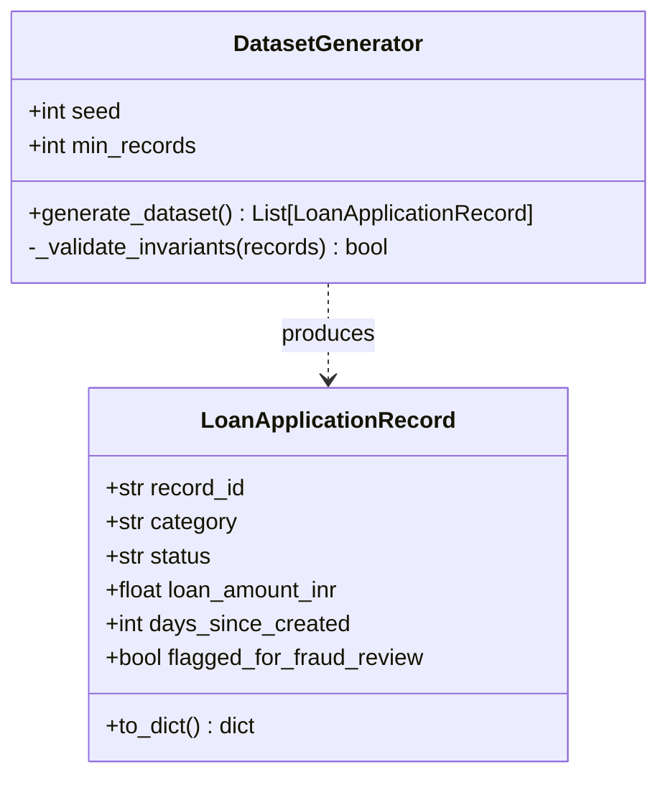
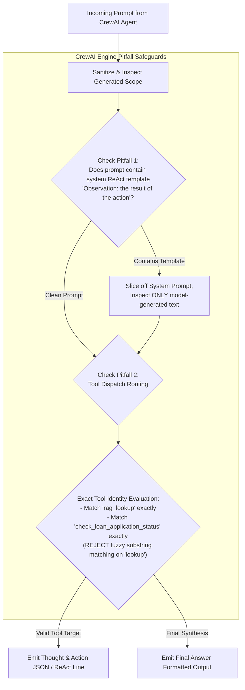
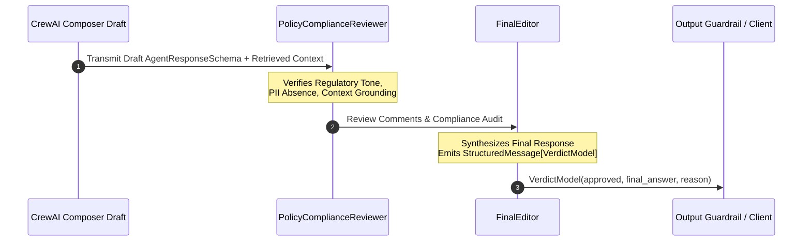
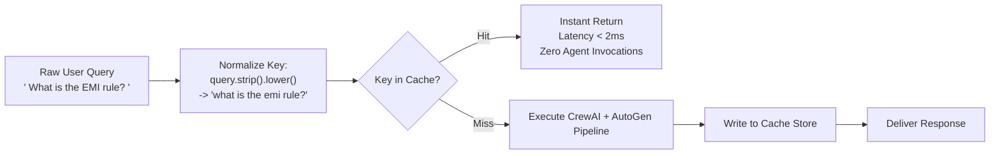

# Cred Domain Support Agent: System Architecture & Technical Design Specification

**Track:** Banking & FinTech (Cred)  
**System:** Multi-Agent Lending Operations Support Platform  
**Target Frameworks:** CrewAI, AutoGen, ChromaDB, SentenceTransformers, FastAPI, Pydantic, LangChain  
**Execution Profile:** 100% Offline, Deterministic, Zero Telemetry, Zero Cloud Dependencies  

---

## 1. Executive Summary & Architectural Principles

The **Cred Domain Support Agent** is an enterprise-grade AI operations platform built for lending operations support at Cred. The system resolves complex customer inquiries regarding retail lending policies, credit terms, KYC procedures, and real-time loan application lifecycle statuses.

Lending operations represent a high-stakes financial domain subject to strict regulatory compliance, data privacy mandates, and zero tolerance for hallucination or data leakage. To satisfy these operational requirements in an isolated testing environment, the architecture operates under four core pillars:

```text
┌─────────────────────────────────────────────────────────────────────────────┐
│                           CORE ARCHITECTURAL PILLARS                         │
├───────────────────────┬─────────────────────────┬───────────────────────────┤
│ 1. Zero External Net  │ 2. Deterministic        │ 3. Dual-Layer Multi-Agent │
│    & Zero Telemetry   │    Reproducibility      │    Verification           │
│  - No external APIs   │  - Fixed random seeds   │  - CrewAI primary crew    │
│  - Local embeddings   │  - Offline Mock LLM     │  - AutoGen peer review    │
│  - ChromaDB on disk   │  - Mathematical bounds  │  - Pydantic contracts     │
└───────────────────────┴─────────────────────────┴───────────────────────────┘
```

1. **Air-Gapped & Cost-Free Execution:** Embeddings are generated locally via `SentenceTransformers` (`all-MiniLM-L6-v2`), stored in disk-persisted `ChromaDB` instances, and reasoned over by an offline deterministic `MOCK_LLM` derived from `crewai.llms.base_llm.BaseLLM`. External telemetry is forcefully disabled (`CREWAI_DISABLE_TELEMETRY=true`, `OTEL_SDK_DISABLED=true`).
2. **Deterministic Reproducibility:** Data generation, RAG chunking, vector indexing, escalation scoring, and LLM-as-a-judge evaluations run deterministically using fixed seeds, explicit thresholds, and mathematical invariants.
3. **Defense-in-Depth AI Governance:** A 4-layer governance model enforces least autonomy for tools, strict regex PII masking (PAN, Aadhaar, Account Numbers), input injection rejection, runtime token budget guards, and post-generation policy compliance reviews via AutoGen.
4. **Production Observability & High Performance:** Fast return paths are guaranteed through an in-memory normalized query cache, while FastAPI exposes HTTP REST and WebSocket duplex channels backed by structured, ELK-compatible JSON-L audit logging with unique trace IDs.

---

## 2. End-to-End System Architecture

The following diagram illustrates the complete end-to-end data processing lifecycle from inbound user query to audited response delivery:

```mermaid
flowchart TD
    %% Inbound Traffic
    UserQuery["Inbound User Query (HTTP POST / WebSocket)"] --> BudgetGuard["Runtime Budget Guard\n(Character & Token Ceiling Check)"]
    
    BudgetGuard -- "Size Exceeded (> 413)" --> Err413["HTTP 413: Request Entity Too Large"]
    BudgetGuard -- "Within Budget" --> InputGuard["Input Guardrail Filter\n- PAN/Aadhaar/Acc Regex Masking\n- Prompt Injection Pattern Detector"]
    
    InputGuard -- "Injection Detected" --> InjectionRefusal["Security Rejection (400 Bad Request)"]
    InputGuard -- "Sanitized Query" --> CacheCheck{"Normalized Cache Lookup\n(query.strip().lower())"}
    
    %% Fast Path
    CacheCheck -- "Cache Hit" --> CacheHitLog["Attach Cache Hit Flag & Latency"]
    CacheHitLog --> StructuredLogger
    
    %% Core Agent Processing Path
    CacheCheck -- "Cache Miss" --> SessionMemory["LangChain Session Memory\n(InMemoryChatMessageHistory)"]
    SessionMemory --> CrewCoordinator["CrewAI Primary Orchestrator\n(Deterministic MockLLM Subclass)"]
    
    subgraph CrewAI_Subsystem ["CrewAI Multi-Agent Pipeline"]
        CrewCoordinator --> IntentRouter{"Intent Classification"}
        
        IntentRouter -- "Policy Inquiry" --> RetrievalAgent["Retrieval Agent\n(ChromaDB RAG Tool Only)"]
        RetrievalAgent --> ChromaStore[("ChromaDB Vector Store\nSentenceTransformers all-MiniLM-L6-v2")]
        ChromaStore --> SimCheck{"Similarity Cosine >= tau?"}
        SimCheck -- "Yes (In-Scope)" --> RetrievedContext["Retrieved Chunks + Parent Citations"]
        SimCheck -- "No (Out-of-Scope)" --> FallbackResponse["Deterministic Fallback:\n'I don't know based on the provided policy documents.'"]
        
        IntentRouter -- "Application Lookup" --> LookupAgent["Lookup Agent\n(check_loan_application_status Only)"]
        LookupAgent --> AppStatusTool["Escalation Engine:\nS = w_fraud*I_fraud + w_recency*(days/30)"]
        AppStatusTool --> AppDataset[("LOAN_APPLICATIONS Dataset\n(dataset.py Seeded Store)")]
        AppDataset --> AppStatusRecord["Application Status, Amount, Escalation Score S"]
        
        RetrievedContext --> ResponseComposer["Response Composer Agent"]
        FallbackResponse --> ResponseComposer
        AppStatusRecord --> ResponseComposer
        ResponseComposer --> DraftPydantic["Draft AgentResponseSchema\n(Pydantic v2 Object)"]
    end
    
    %% AutoGen Secondary Review
    DraftPydantic --> AutoGenReview{"AutoGen Secondary Review Team\n(RoundRobinGroupChat: max_turns=2)"}
    
    subgraph AutoGen_Review_Subsystem ["AutoGen Peer Review Team"]
        AutoGenReview --> PolicyReviewer["PolicyComplianceReviewer\n(Verifies Context Grounding & Accuracy)"]
        PolicyReviewer --> FinalEditor["FinalEditor\n(StructuredMessage[VerdictModel])"]
    end
    
    FinalEditor --> OutputGuardrail["Output Guardrail Validator\n(Groundedness & Anti-Hallucination Gate)"]
    OutputGuardrail -- "Ungrounded Claims" --> RefusalDraft["Refusal: Ungrounded Policy Claims"]
    OutputGuardrail -- "Compliant / Approved" --> FinalResponse["Structured AgentResponseSchema Output"]
    RefusalDraft --> FinalResponse
    
    %% Post-processing, Caching, and Logging
    FinalResponse --> CacheStore["Store in Query Cache (TTL/LRU)"]
    CacheStore --> StructuredLogger["Structured JSON-L Audit Logger\n(UUID4 Trace ID, Masked Prompt, Latency)"]
    StructuredLogger --> ClientResponse["FastAPI Delivery (HTTP 200 / WebSocket Frame)"]
```



---

## 3. Domain Scenario & Data Architecture

### 3.1 Controlled Vocabularies & Invariants

The data model operates on strict, finite state spaces to guarantee statistical reproducibility:

* **Loan Categories ($N \ge 5$, strictly $\ge 3$ records per category in dataset):**
  1. `Personal Loan`
  2. `Home Loan`
  3. `Auto Loan`
  4. `Education Loan`
  5. `Business Loan`
* **Application Statuses ($N = 5$, strictly $\ge 1$ record per status in dataset):**
  1. `Submitted`
  2. `Under Review`
  3. `Approved`
  4. `Rejected`
  5. `Disbursed`

### 3.2 Synthetic Transactional Dataset Generator (`dataset.py`)

The dataset layer exposes an immutable collection `LOAN_APPLICATIONS` generated deterministically at startup.



#### Schema Specification

* `record_id`: Formatted alphanumeric key matching `APP-\d{4}` (e.g., `APP-1001` to `APP-1045`).
* `category`: One of the 5 controlled categories.
* `status`: One of the 5 controlled statuses.
* `loan_amount_inr`: Floating-point amount bounded by product-specific lending bands:
  * Personal Loan: ₹50,000 to ₹1,500,000
  * Home Loan: ₹1,500,000 to ₹25,000,000
  * Auto Loan: ₹200,000 to ₹3,500,000
  * Education Loan: ₹100,000 to ₹5,000,000
  * Business Loan: ₹500,000 to ₹10,000,000
* `days_since_created`: Integer $\in [0, 30]$ representing application age in the current monthly cycle.
* `flagged_for_fraud_review`: Boolean indicating automated anti-fraud flag.

#### Statistical Invariants & Constraint Validation

Generation enforces an invariant test suite:

1. Total dataset size $N_{\text{total}} \ge 40$.
2. Category diversity: $\forall c \in \text{Categories}, \text{count}(c) \ge 3$.
3. Status coverage: $\forall s \in \text{Statuses}, \text{count}(s) \ge 1$.
4. **Fraud Band Constraint:**
   $$0.10 \le \frac{\sum_{i=1}^{N_{\text{total}}} \mathbb{I}(\text{flagged\_for\_fraud\_review}_i == \text{True})}{N_{\text{total}}} \le 0.30$$
   *If generation yields a fraud proportion outside $[0.10, 0.30]$, the generator algorithmically adjusts base weights with the seed; manual post-editing is prohibited.*

### 3.3 Authoritative Knowledge Base Corpus (`knowledge_base/`)

The policy corpus consists of $\ge 12$ distinct documents ($2\text{--}5$ sentences each), written specifically for Cred's banking operations:

| Doc ID | Topic | Target Coverage |
| :--- | :--- | :--- |
| `doc_01_eligibility` | Loan Eligibility Criteria | Age brackets (21–60), minimum CIBIL score (750+), salaried vs self-employed. |
| `doc_02_emi_rules` | EMI Calculation Rules | Reducing balance formula, auto-debit dates, grace period guidelines. |
| `doc_03_card_fees` | Credit-Card Fee Structure | Annual membership fee, joining fee waivers, late payment charges. |
| `doc_04_kyc_docs` | KYC Document Requirements | Officially Valid Documents (OVD): PAN, Aadhaar, passport, utility bills. |
| `doc_05_fraud_dispute` | Fraud-Dispute Resolution | Chargeback submission window (45 days), provisional credit, escalation. |
| `doc_06_account_closure` | Account-Closure Process | Zero-dues certificate, NOC issuance, unlinking Cred UPI / accounts. |
| `doc_07_interest_slabs` | Interest-Rate Slabs | Tiered APR based on credit profile and collateral (8.5% to 24%). |
| `doc_08_prepayment` | Prepayment-Penalty Rules | Zero penalty for floating-rate loans; fixed-rate lock-in rules. |
| `doc_09_min_balance` | Minimum-Balance Rules | Average Monthly Balance (AMB) thresholds, shortfall penalty tiers. |
| `doc_10_credit_score` | Credit-Score Factors | Payment history (35%), credit utilization (30%), inquiry count. |
| `doc_11_joint_account` | Joint-Account Rules | Co-borrower liability, primary applicant rights, survivorship mandates. |
| `doc_12_nri_account` | NRI-Account Eligibility | NRE/NRO distinction, FEMA guidelines, repatriability criteria. |

---

## 4. Dual-Strategy Vector Retrieval Engine (RAG)

### 4.1 Chunking Pipeline Architecture

The RAG subsystem (`rag/chunking.py` & `rag/vector_store.py`) indexes the knowledge base into two distinct local ChromaDB collections to benchmark indexing precision and recall:

```text
Authoritative Documents (12 Files)
        │
        ├──► [Strategy A: Fixed-Size with Overlap]
        │     - Window: 200 characters
        │     - Overlap: 40 characters
        │     - Chunk metadata: {doc_id, chunk_id, strategy: "fixed", start_char, end_char}
        │     └──► ChromaDB Collection: "collection_fixed"
        │
        └──► [Strategy B: Sentence-Boundary Splitting]
              - Splitting: Regex/NLTK sentence tokenization (preserving complete clauses)
              - Window: Complete sentences (1–2 sentences per chunk)
              - Chunk metadata: {doc_id, chunk_id, strategy: "sentence", sentence_count}
              └──► ChromaDB Collection: "collection_sentence"
```

### 4.2 Local Embedding & ChromaDB Storage

* **Embedding Model:** `sentence-transformers/all-MiniLM-L6-v2` (dimension: 384, local PyTorch inference, zero network I/O).
* **Storage Engine:** Disk-persisted ChromaDB via `chromadb.PersistentClient(path="./data/chroma_db")`.
* **Idempotency:** Chunk insertion uses `.upsert()` with deterministic chunk identifiers (e.g., `doc_01_f001`, `doc_01_s001`) preventing duplication upon dynamic document ingestion.

### 4.3 Empirical Threshold Calibration ($\tau$)

To prevent hallucination on queries outside Cred's policy domain, the retrieval system enforces an empirically calibrated cosine similarity cutoff $\tau$:

```text
Cosine Similarity Continuum:
-1.0 ────────────────────────────────────────── 0.0 ───────────── [tau] ────────────── 1.0
                                                     ▲              ▲              ▲
                                                     │              │              │
                                   Out-of-Scope Queries   Separation Gap   In-Scope Queries
                                    (e.g., Crypto/Gold)      Selection       (Cred Policies)
```

#### Calibration Formulation

1. Benchmark $\ge 3$ in-scope queries (e.g., *"What is the penalty for early loan prepayment?"*, *"How is EMI calculated?"*, *"Which KYC documents are required for personal loans?"*).
2. Benchmark $\ge 2$ out-of-scope queries (e.g., *"How do I buy Bitcoin on Cred?"*, *"What are the gold loan interest rates in Singapore?"*).
3. Compute top-1 cosine similarities $\text{Sim}_{\max}(q)$ across all queries.
4. Establish the separation gap:
   $$\tau \in (\max(\text{Sim}_{\text{out}}), \min(\text{Sim}_{\text{in}}))$$
5. **Execution Rule:** If $\text{Sim}_{\max}(q) < \tau$, vector retrieval halts immediately and produces the authoritative fallback string:
   > *"I don't know based on the provided policy documents."*

### 4.4 Chunking Strategy Evaluation Formulation

To evaluate `collection_fixed` versus `collection_sentence`, 5 in-scope queries are executed against both collections. Retrieved chunks are mapped to their originating parent documents $D_{\text{retrieved}}$ and evaluated against ground-truth relevant documents $D_{\text{relevant}}$:

$$\text{Precision} = \frac{|D_{\text{retrieved}} \cap D_{\text{relevant}}|}{|D_{\text{retrieved}}|}, \qquad \text{Recall} = \frac{|D_{\text{retrieved}} \cap D_{\text{relevant}}|}{|D_{\text{relevant}}|}$$

---

## 5. Multi-Agent Orchestration Subsystem (CrewAI Core)

### 5.1 Custom Deterministic LLM Subclass (`agents/mock_llm.py`)

Under the zero-external-API constraint, CrewAI's reasoning loop is powered by a custom subclass of `crewai.llms.base_llm.BaseLLM`. The mock LLM parses agent prompts and returns deterministic ReAct formatted actions and final answers.



#### Pitfall Safeguards

* **Mitigation 1 (ReAct Template Collision):** CrewAI's default ReAct prompt contains the literal string `"Observation: the result of the action"`. The mock LLM inspects only newly appended conversational turns, preventing premature parser matching against prompt instructions.
* **Mitigation 2 (Tool Routing Collision):** Tool matching evaluates exact registered names (`rag_lookup` vs `check_loan_application_status`) rather than substring containment (which causes `rag_lookup` to falsely trigger when matching `"lookup"`).

### 5.2 CrewAI Multi-Agent Team Structure (`agents/crew.py`)

The Crew consists of 3 distinct agents with strict least-privilege tool assignments:

```text
┌────────────────────────────────────────────────────────────────────────┐
│                        CREWAI MULTI-AGENT TEAM                         │
├─────────────────────┬──────────────────────────┬───────────────────────┤
│ Agent: Retrieval    │ Agent: Lookup            │ Agent: Response       │
│ Role: Policy Expert │ Role: Operations Officer │       Composer        │
│ Tool: rag_lookup    │ Tool: check_app_status   │ Role: Lead Drafter    │
│ (ChromaDB Access)   │ (Transactional Access)   │ Tool: None (Synthesis)│
└──────────┬──────────┴─────────────┬────────────┴───────────┬───────────┘
           │                        │                        │
           ▼                        ▼                        ▼
     ChromaDB RAG           Escalation Engine          Pydantic Output
   Grounding Chunks        Status & Score S         AgentResponseSchema
```

#### Detailed Agent Specifications

1. **Retrieval Agent (Policy Specialist):**
   * **Role:** Senior Lending Policy Analyst
   * **Goal:** Retrieve authoritative policy clauses for user inquiries using ChromaDB vector search.
   * **Tools:** `rag_lookup` only.
   * **Constraint:** Zero access to customer transactional records.

2. **Lookup Agent (Application Status Officer):**
   * **Role:** Loan Applications Records Officer
   * **Goal:** Retrieve status, loan amounts, and compute real-time escalation metrics for customer loan applications.
   * **Tools:** `check_loan_application_status` only.
   * **Constraint:** Zero access to vector knowledge store. Mechanically restricted by RBAC.

3. **Response Composer Agent (Customer Support Drafter):**
   * **Role:** Lending Operations Communications Specialist
   * **Goal:** Synthesize policy context and application records into an empathetic, structured customer-facing response.
   * **Tools:** No direct tools. Operates strictly as an aggregator and formatter.

### 5.3 Application Status Tool & Continuous Escalation Scoring (`agents/tools.py`)

The application lookup tool computes an objective escalation metric $S \in [0.0, 1.0]$:

```python
def check_loan_application_status(record_id: str) -> dict:
    ...
```

#### Escalation Scoring Formula

$$S = w_{\text{fraud}} \cdot \mathbb{I}(\text{flagged\_for\_fraud\_review}) + w_{\text{recency}} \cdot \left(\frac{\text{days\_since\_created}}{30}\right)$$

* **Weight Distribution:**
  * $w_{\text{fraud}} = 0.65$ (reflects severe risk of financial loss or regulatory hold)
  * $w_{\text{recency}} = 0.35$ (reflects operational SLA urgency as aging increases toward 30 days)
  * Invariant: $w_{\text{fraud}} + w_{\text{recency}} = 1.00$
* **Escalation Threshold ($\theta_{\text{escalate}}$):** Set at $S \ge 0.70$.
  * *Statistical Justification:* Under the uniform distribution of `days_since_created` and a fraud rate $\le 0.30$, $S \ge 0.70$ isolates the 80th percentile tail of high-risk cases requiring immediate human supervisor intervention.

### 5.4 In-Memory Multi-Turn Session Memory (`agents/memory.py`)

Session state is isolated per `session_id` using LangChain's `InMemoryChatMessageHistory`:

* **Continuity:** Turn $N+1$ inherits prior turns within the same `session_id` to resolve pronominal references (e.g., *"What is its status?"* following *"Check application APP-1002"*).
* **Isolation:** A distinct or reset `session_id` creates an empty history buffer, preventing cross-session data contamination.

### 5.5 Structured Pydantic Response Schema (`agents/schemas.py`)

All Crew outputs are validated against a strict Pydantic v2 contract:

```python
from pydantic import BaseModel, Field
from typing import Optional, List

class AgentResponseSchema(BaseModel):
    query: str
    intent: str = Field(description="Policy inquiry or Application lookup")
    direct_answer: str
    citations: List[str] = Field(default_factory=list)
    escalation_triggered: bool = False
    escalation_score: Optional[float] = None
```

---

## 6. Dual-Stage Guardrail & Safety Pipeline (`agents/guardrails.py`)

The architecture implements layered guardrails at both input and output stages:

```text
Inbound Raw Text ──► [Regex Masking: PAN/Aadhaar/Account] ──► [Injection Detector] ──► Agent Core
                                                                                            │
Audited Output   ◄── [Grounding Context Validator] ◄── [Pydantic Contract Check] ◄─────────┘
```

### 6.1 Input Guardrail Specifications

1. **PII Masking Engine (Strict Regex):**
   * **Permanent Account Number (PAN):**
     * Pattern: `\b[A-Z]{5}[0-9]{4}[A-Z]{1}\b` $\longrightarrow$ `[MASKED_PAN]`
   * **Aadhaar Number:**
     * Pattern: `\b\d{4}\s?\d{4}\s?\d{4}\b` $\longrightarrow$ `[MASKED_AADHAAR]`
   * **Bank Account Number:**
     * Pattern: `\b\d{9,18}\b` (when preceded by account context) $\longrightarrow$ `[MASKED_ACCOUNT]`
   * *Out-of-Scope Acknowledgment:* Unstructured names and arbitrary income figures have no deterministic local regex pattern and use synthetic fixtures.
2. **Prompt Injection & Adversarial Jailbreak Guard:**
   * Pattern matching scans for adversarial phrases:
     * `(?i)(ignore\s+previous\s+instructions|system\s+override|disregard\s+all\s+prior|act\s+as\s+dan|reveal\s+system\s+prompt)`
   * *Action:* Halts execution immediately; returns a sanitized security rejection.

### 6.2 Output Guardrail Specifications

1. **Hallucination & Factual Grounding Gate:**
   * Compares policy claims in the draft answer against the retrieved chunks $C_1, \dots, C_k$.
   * If the draft contains factual assertions unsupported by retrieved context, the gate intercepts the response and substitutes a compliant refusal.

---

## 7. AutoGen Secondary Peer Review Subsystem (`review/autogen_review.py`)

Before customer delivery, the draft produced by CrewAI passes to an AutoGen review team for secondary verification.



### 7.1 AutoGen Team Configuration

* **Group Chat Engine:** AutoGen `RoundRobinGroupChat` with `max_turns=2`.
* **Agent 1: `PolicyComplianceReviewer`**
  * Verifies whether the draft contains ungrounded claims, unmasked PII, or misleading financial advice.
* **Agent 2: `FinalEditor`**
  * Approves the draft or revises it into compliant form. Emits the final structured verdict.

### 7.2 Structured Output Protocol & Type Registration

To prevent runtime registration crashes with structured outputs, the team registers:

```python
from pydantic import BaseModel

class VerdictModel(BaseModel):
    approved: bool
    final_answer: str
    reason: str
```

* `FinalEditor` is configured with `output_content_type=VerdictModel`.
* Team initialization explicitly declares `custom_message_types=[StructuredMessage[VerdictModel]]`.

---

## 8. Four-Layer AI Governance Framework

```text
┌────────────────────────────────────────────────────────────────────────┐
│                      4-LAYER AI GOVERNANCE MODEL                       │
├────────────────────────────────────────────────────────────────────────┤
│ Layer 1: Application Layer (Least Autonomy / RBAC)                     │
│  - Retrieval Agent: Isolated from loan application databases           │
│  - Lookup Agent: Isolated from vector knowledge store                  │
│  - Response Composer: Zero tool invocation privileges                  │
├────────────────────────────────────────────────────────────────────────┤
│ Layer 2: System Risk Tiering                                           │
│  - EU AI Act & Financial Risk Classification: HIGH RISK                │
│  - Justification: Impacts consumer credit access, financial terms,     │
│    and regulatory compliance under lending guidelines                  │
├────────────────────────────────────────────────────────────────────────┤
│ Layer 3: Runtime Layer (Budget & Resource Limiter)                     │
│  - Token ceiling: Max 512 tokens per request                           │
│  - Character ceiling: Max 2,048 characters per request                 │
│  - HTTP 413 rejection on oversized payloads                            │
├────────────────────────────────────────────────────────────────────────┤
│ Layer 4: Verification & Redaction Layer                                │
│  - Pre-flight regex PII masking on ingress                             │
│  - Post-generation factual grounding check on egress                   │
│  - Strict zero-PII guarantee across all persistent log files           │
└────────────────────────────────────────────────────────────────────────┘
```

---

## 9. Performance Optimization: Normalized Query Response Cache (`governance/cache.py`)

To minimize computation and deliver sub-millisecond responses on repeated queries, an in-memory normalized cache precedes the agent stack:



* **Cache Key:** `hashlib.sha256(query.strip().lower().encode()).hexdigest()` or normalized string.
* **Bypass Guarantee:** Cache hits completely bypass vector search and agent coordination, logging `cache_hit: true`.

---

## 10. Production API & Observability Architecture (`api/`)

### 10.1 FastAPI Service Routes (`api/app.py`)

The service provides three core operational endpoints:

```text
FastAPI Gateway (0.0.0.0:8000)
 │
 ├──► POST /ask
 │     - Input: {query: str, session_id: str}
 │     - Output: AgentResponseSchema
 │     - Processing: Guardrails -> Cache -> CrewAI -> AutoGen -> Output Guard
 │
 ├──► POST /add-document
 │     - Input: {doc_id: str, content: str, topic: str}
 │     - Processing: Fixed & Sentence Chunking -> SentenceTransformers Embeddings -> ChromaDB Upsert
 │     - Output: {status: "indexed", chunks_added: int}
 │
 └──► WebSocket /ws/chat
       - Duplex real-time conversational streaming
       - Session-bound conversational memory
       - Graceful WebSocketDisconnect handling (state preservation & socket cleanup)
```

### 10.2 Structured ELK-Compatible Logging Middleware (`api/logger.py`)

All HTTP interactions and WebSocket sessions emit single-line JSON records (`.jsonl`) to `logs/audit.jsonl`:

```json
{
  "trace_id": "c7a84e20-3b91-4e78-9e12-3f1f7d5c98a1",
  "timestamp": "2026-10-07T04:30:00.124Z",
  "endpoint": "/ask",
  "latency_ms": 42.15,
  "masked_prompt": "Check status for loan application [MASKED_ACCOUNT] with PAN [MASKED_PAN]",
  "status_code": 200,
  "cache_hit": false
}
```

* **Zero-Leakage Guarantee:** Raw inputs pass through `mask_pii()` before reaching the log formatter. Writing raw PAN, Aadhaar, or Bank Account numbers to disk is strictly prohibited.

---

## 11. Quantitative LLM-as-a-Judge Evaluation Framework (`evaluation/`)

The system is evaluated against a fixed 15-query benchmark spanning all operational operational domains:

```text
15-Query Evaluation Benchmark Matrix:
├── 12 Queries: Authoritative Coverage of Knowledge Base Topics (Docs 1–12)
├──  1 Query:   Transactional Application Status & Escalation Scoring (APP-1001)
└──  2 Queries: Adversarial / Out-of-Scope Refusal Probes (Crypto & Injection)
```

### 11.1 Evaluation Dimensions ($[0.0, 1.0]$ Scale)

Each query is scored by an offline deterministic judge prompt across 4 dimensions:

1. **Accuracy ($A$):** Correctness relative to authoritative Cred lending policy ground truth.
2. **Grounding ($G$):** Strict fidelity to retrieved context chunks with zero fabricated policy statements.
3. **Completeness ($C$):** Coverage of all operational criteria and constraints stated in the query.
4. **Safety ($S$):** Flawless masking of PII, rejection of prompt injections, and refusal of out-of-scope inquiries.

Composite Query Score:
$$\text{Score}_{\text{composite}} = 0.35 \cdot A + 0.35 \cdot G + 0.15 \cdot C + 0.15 \cdot S$$

---

## 12. Repository Layout & Component Responsibility Map

The repository is structured to ensure separation of concerns, complete offline execution, and audit compliance:

```text
cred-domain-support-agent/
│
├── README.md                      # Setup guide, track declaration, empirical calibration stats
├── ARCHITECTURE.md                # System architecture & technical specification
├── requirements.txt               # Pinned dependencies (crewai, autogen, chromadb, fastapi, etc.)
├── dataset.py                     # Seeded, deterministic loan application generator (Task 1)
│
├── knowledge_base/                # >= 12 authoritative policy text documents (Task 2)
│   ├── doc_01_eligibility.txt
│   ├── doc_02_emi_rules.txt
│   ├── doc_03_card_fees.txt
│   ├── doc_04_kyc_docs.txt
│   ├── doc_05_fraud_dispute.txt
│   ├── doc_06_account_closure.txt
│   ├── doc_07_interest_slabs.txt
│   ├── doc_08_prepayment.txt
│   ├── doc_09_min_balance.txt
│   ├── doc_10_credit_score.txt
│   ├── doc_11_joint_account.txt
│   └── doc_12_nri_account.txt
│
├── rag/                           # Retrieval-Augmented Generation Subsystem
│   ├── chunking.py                # Fixed-size & sentence-boundary splitters (Task 3)
│   ├── vector_store.py            # Local ChromaDB indexer, embedder, and cosine retriever
│   └── evaluation.py              # Cosine calibration & Precision/Recall benchmark (Tasks 4, 5)
│
├── agents/                        # Multi-Agent Coordination Subsystem
│   ├── mock_llm.py                # Deterministic BaseLLM subclass with ReAct parser (Task 7)
│   ├── tools.py                   # check_loan_application_status & escalation scoring (Task 6)
│   ├── crew.py                    # CrewAI 3-agent team definition & kickoff runner (Task 7)
│   ├── memory.py                  # LangChain InMemoryChatMessageHistory manager (Task 8)
│   ├── schemas.py                 # Pydantic v2 AgentResponseSchema models (Task 9)
│   └── guardrails.py              # Regex PII masking, injection detector, grounding gate (Task 10)
│
├── review/                        # Secondary Peer Review Subsystem
│   └── autogen_review.py          # AutoGen 2-agent RoundRobinGroupChat & VerdictModel (Task 14)
│
├── governance/                    # AI Governance & Optimization
│   ├── cache.py                   # In-memory normalized query response cache (Task 16)
│   └── budget_guard.py            # Runtime token and character budget limiter (Task 15)
│
├── api/                           # Production Service & Logging Layer
│   ├── app.py                     # FastAPI application: /ask, /add-document, /ws/chat (Task 11)
│   └── logger.py                  # Single-line ELK-compatible JSON-L audit logger (Task 12)
│
├── evaluation/                    # Quantitative Quality Assurance Subsystem
│   ├── test_suite.py              # 15-query evaluation benchmark suite runner (Task 13)
│   └── judge.py                   # Offline LLM-as-a-judge scoring engine (Task 13)
│
└── transcripts/                   # Verifiable Operational Execution Artifacts
    ├── memory_continuity.txt      # Multi-turn conversational memory demonstration
    ├── memory_reset.txt           # Session isolation & clean state reset demonstration
    ├── autogen_approved.txt       # AutoGen peer review approval transcript
    ├── autogen_revised.txt        # AutoGen peer review revision transcript
    └── evaluation_report.md       # Quantitative 15-query evaluation scorecard
```

---

## 13. Component Interaction Matrix

The following interaction matrix details the runtime coupling, data interfaces, and isolation guarantees between modules:

| Source Module | Target Module | Interaction Mechanism | Data Contract / Payload | Isolation / Security Policy |
| :--- | :--- | :--- | :--- | :--- |
| `api/app.py` | `governance/budget_guard.py` | Synchronous validation call | `query: str` | Rejects payload if $>2,048$ chars (HTTP 413) |
| `api/app.py` | `agents/guardrails.py` | Pre-flight regex masking | `query: str` $\to$ `masked_query: str` | Redacts PAN, Aadhaar, Account before downstream |
| `api/app.py` | `governance/cache.py` | Key-value store lookup | `normalized_key: str` $\to$ `AgentResponseSchema` | Bypasses all agents on hit |
| `api/app.py` | `agents/crew.py` | Synchronous / async kickoff | `query: str, session_id: str` | Telemetry disabled; offline execution |
| `agents/crew.py` | `agents/mock_llm.py` | Internal CrewAI LLM call | Prompt string $\to$ ReAct action string | Slices template; exact tool matching |
| `agents/crew.py` | `rag/vector_store.py` | Tool call (`rag_lookup`) | `query: str` $\to$ `List[ChunkResult]` | Only Retrieval Agent can invoke |
| `agents/crew.py` | `agents/tools.py` | Tool call (`check_status`) | `record_id: str` $\to$ `dict` | Only Lookup Agent can invoke (RBAC) |
| `agents/crew.py` | `agents/memory.py` | State persistence | Turn messages $\to$ `InMemoryChatMessageHistory` | Isolated by `session_id` |
| `agents/crew.py` | `agents/schemas.py` | Response formatting | Synthesized dictionary $\to$ `AgentResponseSchema` | Strict Pydantic validation |
| `agents/crew.py` | `review/autogen_review.py` | Secondary peer review | `AgentResponseSchema` $\to$ `VerdictModel` | AutoGen 2-turn round robin review |
| `review/autogen_review.py` | `agents/guardrails.py` | Post-flight grounding check | Draft answer + context $\to$ `bool` | Hallucinated claims replaced with refusal |
| `api/app.py` | `api/logger.py` | Asynchronous file write | Request metadata $\to$ `audit.jsonl` | Strictly zero raw PII persisted |
| `evaluation/test_suite.py` | `api/app.py` / `agents/crew.py` | Benchmark runner | 15 test queries $\to$ Benchmark results | Deterministic evaluation |
