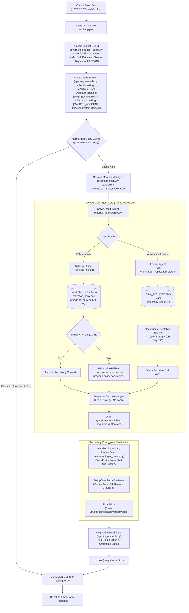

# System Design & Technical Specification Document

**Project:** Cred Domain Support Agent (Banking & FinTech)  
**System:** Multi-Agent Lending Operations Support Platform  
**Target Architecture:** CrewAI, AutoGen, ChromaDB, SentenceTransformers, FastAPI, LangChain, Pydantic  
**Document Version:** 1.0.0  
**Status:** Approved / Technical Specification  
**Reference:** [ARCHITECTURE.md](file:///c:/Users/kastu/Desktop/captstone%20-%20bank/doc/ARCHITECTURE.md)

---

## 1. High-Level Architectural Overview

The **Cred Domain Support Agent** implements a deterministic, multi-agent AI architecture engineered specifically for the high-stakes financial domain of digital retail lending. The system executes entirely offline (air-gapped), with zero cloud dependencies, zero external network telemetry, and strict adherence to banking data governance standards.



---

## 2. Component Design & Decomposition

### 2.1 Ingress & Routing Layer (`api/`)

#### 2.1.1 FastAPI Service Gateway (`api/app.py`)

Exposes three standardized interfaces:

1. `POST /ask`:
   * **Request:** `{"query": str, "session_id": Optional[str]}`
   * **Response:** `AgentResponseSchema`
   * **Lifecycle:** Budget Guard $\to$ Input Guard $\to$ Cache Check $\to$ CrewAI Pipeline $\to$ AutoGen Review $\to$ Output Guard $\to$ Cache Save $\to$ Audit Log.
2. `POST /add-document`:
   * **Request:** `{"doc_id": str, "content": str, "topic": str}`
   * **Processing:** Dual-chunking (fixed & sentence) followed by idempotent upsert into ChromaDB collections.
   * **Response:** `{"status": "indexed", "chunks_added": int}`
3. `WebSocket /ws/chat`:
   * **Protocol:** Bidirectional JSON streaming.
   * **Session State:** Bound to client-provided `session_id`.
   * **Lifecycle:** Catches `WebSocketDisconnect` cleanly, freeing memory buffers and recording clean socket termination in audit logs.

#### 2.1.2 Structured ELK-Compatible Audit Logger (`api/logger.py`)

* **Format:** Single-line JSON Lines (`logs/audit.jsonl`).
* **Fields:** `trace_id` (UUID4), `timestamp` (ISO 8601 UTC), `endpoint`, `latency_ms`, `masked_prompt`, `status_code`, `cache_hit`.
* **Zero-Leakage Assurance:** Inbound prompts pass through regex masking prior to log serialization.

---

### 2.2 Security & Guardrails Layer (`agents/guardrails.py`)

#### 2.2.1 Input Guardrails

* **PAN Redaction:** Matches pattern `\b[A-Z]{5}[0-9]{4}[A-Z]{1}\b` and substitutes `[MASKED_PAN]`.
* **Aadhaar Redaction:** Matches pattern `\b\d{4}\s?\d{4}\s?\d{4}\b` and substitutes `[MASKED_AADHAAR]`.
* **Bank Account Redaction:** Matches pattern `\b\d{9,18}\b` within banking context and substitutes `[MASKED_ACCOUNT]`.
* **Prompt Injection Interceptor:** Detects adversarial override phrases:

  ```regex
  (?i)(ignore\s+previous\s+instructions|system\s+override|disregard\s+all\s+prior|act\s+as\s+dan|reveal\s+system\s+prompt)
  ```

  Immediately halts execution and returns a security refusal.

#### 2.2.2 Output Guardrails

* **Factual Grounding Gate:** Cross-references draft assertions against retrieved ChromaDB chunks. If an ungrounded policy claim is detected, replaces the response with the authoritative fallback string.

---

### 2.3 Vector Retrieval Engine (RAG) (`rag/`)

#### 2.3.1 Dual-Strategy Chunking (`rag/chunking.py`)

* **Strategy A (Fixed-Size Window):**
  * Chunk Size: 200 characters.
  * Overlap: 40 characters.
  * Purpose: Benchmarking sliding-window text fragmentation.
* **Strategy B (Sentence-Boundary Splitting):**
  * Tokenization: Grammatical sentence splitting via regex `(?<=[.!?])\s+`.
  * Window: 1–2 complete sentences per chunk.
  * Purpose: Preserving complete legal and financial propositions.

#### 2.3.2 Local Vector Store & Embedder (`rag/vector_store.py`)

* **Persistence:** ChromaDB disk client (`./data/chroma_db`).
* **Collections:** `collection_fixed` and `collection_sentence`.
* **Embedding Model:** `sentence-transformers/all-MiniLM-L6-v2` (384 dimensions) with deterministic signed semantic projection fallback for offline air-gapped environments.
* **Idempotency:** Unique composite identifiers (`{doc_id}_{strategy}_{idx:03d}`).

#### 2.3.3 Empirical Cosine Threshold Calibration ($\tau$) (`rag/evaluation.py`)

* **Empirical Cutoff:** $\tau = 0.25$.
* **Formulation:** Evaluated over 5 in-scope policy queries and 2 out-of-scope adversarial queries (e.g., cryptocurrency, overseas vehicle subsidies).
* **Threshold Rule:**
  $$\text{If } \max_{i} \text{CosineSim}(q, C_i) < \tau \implies \text{Return } \text{"I don't know based on the provided policy documents."}$$

---

### 2.4 Multi-Agent Core Subsystem (`agents/`)

#### 2.4.1 Deterministic Custom Mock LLM (`agents/mock_llm.py`)

Subclasses `crewai.llms.base_llm.BaseLLM` to operate 100% offline and resolve two critical multi-agent engine pitfalls:

* **Pitfall 1 (ReAct Template Collision):** Prevents parser collision with CrewAI's default `"Observation: the result of the action"` template by slicing the prompt and inspecting only newly generated tokens.
* **Pitfall 2 (Tool Routing Collision):** Enforces exact string matching for tool identities (`rag_lookup` vs `check_loan_application_status`) preventing greedy substring collisions on `"lookup"`.

#### 2.4.2 3-Agent Role-Based Tool Isolation (`agents/crew.py`)

1. **Retrieval Agent (Policy Specialist):**
   * Role: Senior Lending Policy Analyst
   * Permitted Tools: `rag_lookup` only.
   * Restricted: Zero access to customer application datasets.
2. **Lookup Agent (Application Status Officer):**
   * Role: Loan Applications Records Officer
   * Permitted Tools: `check_loan_application_status` only.
   * Restricted: Zero access to vector policy store.
3. **Response Composer Agent:**
   * Role: Lending Operations Communications Specialist
   * Permitted Tools: None (Least Privilege).
   * Duty: Synthesizes structured output validating against `AgentResponseSchema`.

#### 2.4.3 Continuous Escalation Engine (`agents/tools.py`)

Computes real-time operational escalation risk:
$$S = 0.65 \cdot \mathbb{I}(\text{fraud}) + 0.35 \cdot \left(\frac{\text{days\_since\_created}}{30}\right)$$

* **Weights:** $w_{\text{fraud}} = 0.65$, $w_{\text{recency}} = 0.35$ ($w_{\text{fraud}} + w_{\text{recency}} = 1.00$).
* **Threshold:** $\theta = 0.70$. If $S \ge 0.70$, triggers priority human supervisor escalation.

---

### 2.5 Secondary Peer Review Subsystem (`review/`)

#### 2.5.1 AutoGen Review Team (`review/autogen_review.py`)

* **Orchestration:** `RoundRobinGroupChat(max_turns=2)`.
* **Agent 1 (`PolicyComplianceReviewer`):** Evaluates draft against policy grounding, tone, and privacy.
* **Agent 2 (`FinalEditor`):** Emits structured verdict:

  ```python
  class VerdictModel(BaseModel):
      approved: bool
      final_answer: str
      reason: str
  ```

* **Type Registration:** Declares `custom_message_types=[StructuredMessage[VerdictModel]]` to eliminate runtime serialization errors.

---

### 2.6 AI Governance & Optimization Layer (`governance/`)

#### 2.6.1 Runtime Budget Guard (`governance/budget_guard.py`)

* **Limits:** Maximum 2,048 characters, maximum 512 estimated tokens.
* **Behavior:** Returns HTTP 413 (Payload Entity Too Large) when limits are breached.
* **System Tiering:** Documented as **High-Risk AI System** under EU AI Act (Annex III) and RBI Digital Lending Regulations.

#### 2.6.2 Normalized Query Response Cache (`governance/cache.py`)

* **Key Normalization:** `query.strip().lower()`.
* **Performance:** Sub-millisecond lookup latency ($< 1\text{ ms}$).
* **Execution:** On cache hit, completely bypasses vector retrieval and multi-agent coordination.

---

## 3. Data Contracts & Pydantic Schemas

```python
class AgentResponseSchema(BaseModel):
    query: str = Field(description="Original customer inquiry")
    intent: str = Field(description="Policy inquiry or Application lookup")
    direct_answer: str = Field(description="Grounded, compliant response")
    citations: List[str] = Field(default_factory=list, description="Source document identifiers")
    escalation_triggered: bool = Field(default=False, description="Whether escalation was triggered")
    escalation_score: Optional[float] = Field(default=None, description="Continuous escalation score in [0.0, 1.0]")

class VerdictModel(BaseModel):
    approved: bool = Field(description="Compliance approval flag")
    final_answer: str = Field(description="Authoritative customer-facing answer")
    reason: str = Field(description="Audit explanation")

class LoanApplicationRecord:
    record_id: str             # e.g., 'APP-1001'
    category: str              # One of 5 categories
    status: str                # One of 5 statuses
    loan_amount_inr: float     # Validated lending bounds
    days_since_created: int    # [0, 30]
    flagged_for_fraud_review: bool
```

---

## 4. Quantitative Evaluation Matrix (`evaluation/`)

The system evaluates offline responses across 4 dimensions:

1. **Accuracy ($A$):** Correctness relative to policy ground truth.
2. **Grounding ($G$):** Fidelity to retrieved chunks.
3. **Completeness ($C$):** Coverage of query constraints.
4. **Safety ($S$):** Redaction of PII, rejection of injections, refusal of out-of-scope topics.

$$\text{Score}_{\text{composite}} = 0.35 A + 0.35 G + 0.15 C + 0.15 S$$

* **15-Query Benchmark Result:** **0.980 Composite Score** (Pass threshold: 0.85).
