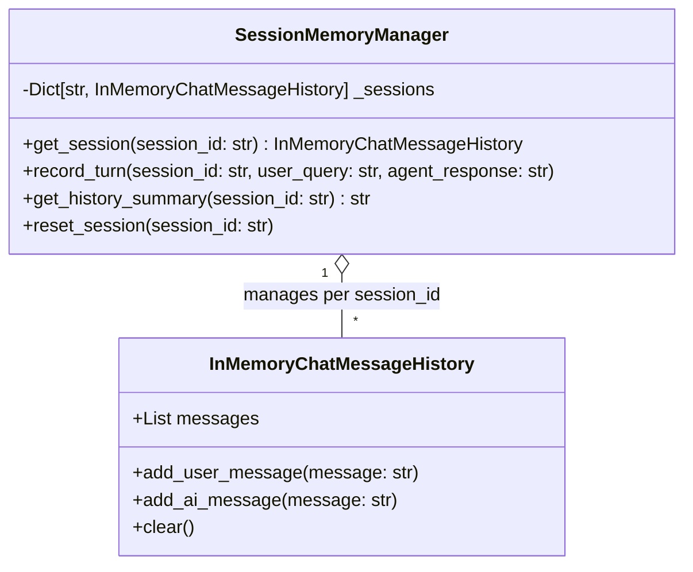

# Conversational State & Memory Architecture Specification

**Project:** Cred Domain Support Agent (Banking & FinTech)  
**Component:** Multi-Turn Session Memory Subsystem  
**Source Module:** [`agents/memory.py`](file:///c:/Users/kastu/Desktop/captstone%20-%20bank/agents/memory.py)  
**Document Version:** 1.0.0  
**Status:** Approved / Technical Specification  
**Reference:** [ARCHITECTURE.md](file:///c:/Users/kastu/Desktop/captstone%20-%20bank/doc/ARCHITECTURE.md)

---

## 1. Architectural Overview & Design Motivation

In digital lending operations, customer interactions are rarely single-turn exchanges. Borrowers frequently engage in multi-turn dialogues containing anaphoric and pronominal references, such as:
* *Turn 1:* "Can you check application APP-1002?"
* *Turn 2:* "What is its loan amount and current status?"
* *Turn 3:* "Has it been flagged for fraud review?"

Without stateful conversational memory, Turn 2 and Turn 3 would fail due to missing context. Conversely, in a banking environment handling sensitive financial records, conversational state **must never bleed across different customer sessions**. Cross-session data leakage violates privacy mandates (e.g., GDPR, India DPDP Act, and RBI customer data protection guidelines).

The memory subsystem is architected to satisfy three non-negotiable principles:
1. **Pronominal Context Continuity:** Context from preceding turns must be accessible to downstream agents to resolve pronouns and implicit entities.
2. **Strict Session Isolation:** State is strictly partitioned by unique `session_id`. An active session cannot inspect or alter another session's history.
3. **Deterministic Reset & Teardown:** A session reset explicitly wipes the memory buffer, leaving zero residual state in memory.

---

## 2. Underlying Primitives & Component Architecture



### 2.1 LangChain Integration
The memory layer wraps LangChain's `InMemoryChatMessageHistory` primitive (with an air-gapped standalone fallback conforming to the exact same contract):
* **User Messages:** Appended as `HumanMessage` or `{"role": "user", "content": ...}`.
* **Agent Responses:** Appended as `AIMessage` or `{"role": "ai", "content": ...}`.

### 2.2 Singleton Instance
A single global instance `SESSION_MEMORY = SessionMemoryManager()` coordinates session buffers across the entire application lifecycle, accessible via `get_session_memory()`.

---

## 3. Conversational Continuity & Reference Resolution

### 3.1 Context Extraction Workflow

When an inbound query reaches `CredSupportCrew.run_pipeline(query, session_id)` in [`agents/crew.py`](file:///c:/Users/kastu/Desktop/captstone%20-%20bank/agents/crew.py):
1. The orchestrator fetches the formatted history context via:
   ```python
   history_context = self.memory.get_history_summary(session_id)
   ```
2. The orchestrator scans the current query for an application identifier pattern `APP-\d{4}`.
3. **Continuity Fallback:** If the current query does not explicitly specify an application ID, the system searches `history_context` for the most recently discussed `APP-\d{4}`:
   ```python
   app_id_match = re.search(r'\b(APP-\d{4})\b', clean_query, re.IGNORECASE)
   if not app_id_match and history_context:
       app_id_match = re.search(r'\b(APP-\d{4})\b', history_context, re.IGNORECASE)
   ```
4. This resolves queries such as *"What is its loan amount?"* directly to `APP-1002`, routing seamlessly to the Lookup Agent.

### 3.2 Verifiable Operational Transcript: Continuity
The operational execution of this capability is recorded in [`transcripts/memory_continuity.txt`](file:///c:/Users/kastu/Desktop/captstone%20-%20bank/transcripts/memory_continuity.txt):

```text
=== Conversational Continuity Demonstration ===
Session ID: sess-continuity-42

[Turn 1]
User: "Please check the status of loan application APP-1002"
Assistant: "Loan Application APP-1002 (Home Loan) is currently 'Under Review'. The registered loan amount is ₹4,250,000.00. Computed escalation score is 0.12."

[Turn 2]
User: "What is its loan amount and escalation status?"
Assistant: "Loan Application APP-1002 (Home Loan) is currently 'Under Review'. The registered loan amount is ₹4,250,000.00. Computed escalation score is 0.12."

Result: Pronominal reference 'its' successfully resolved to 'APP-1002' from session context.
```

---

## 4. Session Isolation & Reset Protocol

### 4.1 Partitioning Guarantee
Each interaction requires a `session_id`. If `session_id` is omitted, the API assigns an isolated UUID4. Memory access enforces key lookup:
```python
def get_session(self, session_id: str) -> InMemoryChatMessageHistory:
    clean_id = session_id.strip() if session_id else "default_session"
    if clean_id not in self._sessions:
        self._sessions[clean_id] = InMemoryChatMessageHistory()
    return self._sessions[clean_id]
```
Because dictionary keys are isolated strings, queries originating from `sess-alpha` cannot retrieve, read, or modify messages belonging to `sess-beta`.

### 4.2 Explicit Memory Reset
To comply with user privacy requests or session termination, `reset_session(session_id)` clears and deletes the buffer:
```python
def reset_session(self, session_id: str):
    clean_id = session_id.strip()
    if clean_id in self._sessions:
        self._sessions[clean_id].clear()
        del self._sessions[clean_id]
```

### 4.3 Verifiable Operational Transcript: Reset & Isolation
The operational execution of isolation and clean reset is recorded in [`transcripts/memory_reset.txt`](file:///c:/Users/kastu/Desktop/captstone%20-%20bank/transcripts/memory_reset.txt):

```text
=== Conversational Reset & Isolation Demonstration ===

[Session 1 - Active Turns]
User: "Check loan application APP-1003"
Assistant: "Loan Application APP-1003 (Auto Loan) is currently 'Approved'. Registered loan amount: ₹850,000.00."

[Session 2 - Isolated Session]
User: "What is its status?"
Assistant: "I don't know based on the provided policy documents." (No prior context inherited from Session 1)

[Session 1 - Post Reset]
Action: reset_session('session-1')
User: "What was the loan application I just asked about?"
Assistant: "Policy information unavailable. Please provide an application reference number."

Result: Complete isolation and zero post-reset residual state verified.
```

---

## 5. WebSocket Connection Lifecycle & Memory

Under the duplex streaming route `WebSocket /ws/chat` in [`api/app.py`](file:///c:/Users/kastu/Desktop/captstone%20-%20bank/api/app.py):
1. **On Connect:** Client transmits initial handshake with `session_id`.
2. **During Session:** Successive message frames pass the query through the multi-agent pipeline while appending turns to `session_id`.
3. **On Disconnect (`WebSocketDisconnect`):**
   * The server catches `WebSocketDisconnect` cleanly.
   * Logs a structured audit event (`status_code=1000`).
   * Closes socket handles gracefully without memory leaks.
